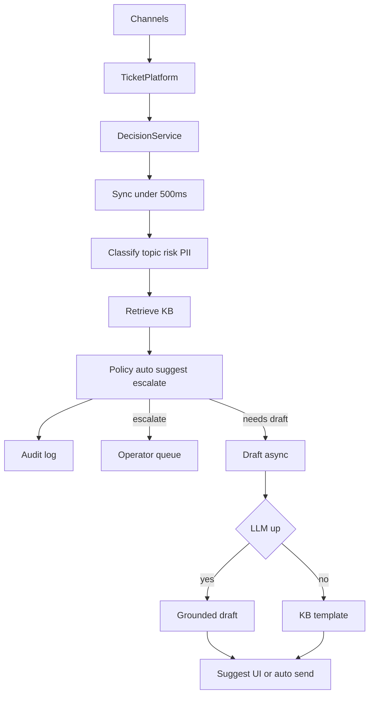

# Architecture

## Цель

Быстро маршрутизировать тикет (тема/риск/куда) и безопасно готовить ответ только там, где это уместно.  
Горячий путь — **без LLM**. Генерация текста — отдельный медленный путь.

## Latency contract

| Путь | Что входит | SLA |
|------|------------|-----|
| **Sync** | normalize → classify topic/risk/PII/injection → retrieve KB → policy | **p95 &lt; 500 ms** |
| **Draft** (async в проде) | LLM или template по KB | секунды OK, **не** в бюджете 500 ms |

В PoC draft вызывается сразу после sync для демо, но `latency_ms_sync` генерацию **не включает**. В проде — очередь worker'ов.

## Почему LLM не на classify

Пики 10–20k / 10 мин + cost + хвосты latency. Classify = rules → позже lightweight ML. LLM только для текста ответа (и то не всегда: outage можно закрыть шаблоном).

## Как встроить в существующую систему

```text
Каналы (chat / email / web / mobile)
        ↓
Текущая Ticket Platform (очередь, статусы, UI оператора)  ← уже есть
        ↓  событие «новый тикет»
Decision Service (наш контур)
        ↓
результат: decision + reason + KB hits (+ draft позже)
        ↓
┌─────────────┬──────────────┬─────────────────┐
escalate      suggest        auto (узкий allowlist)
→ очередь     → черновик     → ответ пользователю
  оператора     в UI агента    (после пилота)
```

Хранилища (целевые): тикеты/статусы — в текущей платформе; KB — search index; audit решений — append-only лог; опционально feature/log store для обучения.  
В PoC: JSON fixtures + `logs/decisions.jsonl`.

## Поток данных



## Компоненты

| Компонент | PoC | Target |
|-----------|-----|--------|
| Ingress | FastAPI `/tickets/process` | адаптер к ticket bus |
| Classifier | rules (`classifier.py`) | lightweight ML + rules |
| Retriever | keyword (`retrieval.py`) | BM25 / embeddings + ANN |
| Policy | `decide()` | тот же контракт + allowlist/denylist |
| Draft | mock LLM / template | LLM API + circuit breaker |
| Audit | jsonl | централизованный audit |

## Ticket taxonomy → action

| Класс | Risk | Action |
|-------|------|--------|
| FAQ / password reset | LOW | suggest → auto (после пилота) |
| Outage | MED | suggest + status template |
| Billing / refund / PII | HIGH | escalate always |
| Account delete / legal | HIGH | escalate |
| Unknown / low conf | — | escalate |
| Prompt injection | HIGH | escalate, не исполнять |

## Human-in-the-loop

- HIGH / PII / injection / low conf / unknown → только оператор.  
- Suggest: оператор видит draft + KB snippets.  
- Auto — только allowlist + высокие пороги + kill-switch.

## Fallback / peak

1. LLM down → template; `auto_reply` → `suggest`; sync-маршрут всё равно быстрый.  
2. Empty retrieve → не auto.  
3. Пик → throttle LLM, outage templates, приоритет очереди по SLA/risk.

## PoC vs target (честно)

| Упрощение PoC | Замена в цели |
|---------------|----------------|
| rules classify | calibrated classifier на размеченных тикетах |
| keyword KB | semantic retrieval |
| mock draft string | grounded LLM + eval |
| in-process draft | async queue |
| нет UI оператора | suggest в существующем agent desktop |
