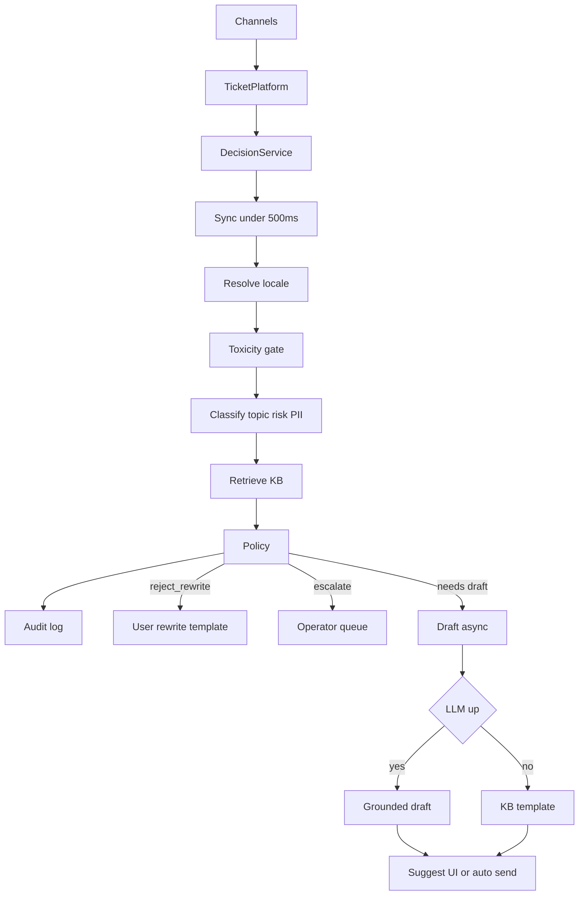

# Architecture

## Цель

Быстро маршрутизировать тикет (тема/риск/куда) и безопасно готовить ответ только там, где это уместно.  
Горячий путь — **без LLM**. Генерация текста — отдельный медленный путь.

## Latency contract

| Путь | Что входит | SLA |
|------|------------|-----|
| **Sync** | normalize → locale → toxicity gate → classify/PII/injection → retrieve → policy | **p95 &lt; 500 ms** |
| **Draft** (async в проде) | LLM или template по KB | секунды OK, **не** в бюджете 500 ms |

В PoC draft вызывается сразу после sync для демо, но `latency_ms_sync` генерацию **не включает**. В проде — очередь worker'ов.

## Почему LLM не на classify

Пики 10–20k / 10 мин + cost + хвосты latency. Classify = rules → позже lightweight ML. LLM только для текста ответа (и то не всегда: outage можно закрыть шаблоном).

## Как встроить в существующую систему

```text
Каналы (chat / email / web / mobile)
        ↓
Текущая Ticket Platform (очередь, статусы, UI оператора)  ← уже есть
        ↓  событие «новый тикет»
Decision Service (наш контур)
        ↓
результат: decision + reason + KB hits (+ draft позже)
        ↓
┌──────────────┬─────────────┬──────────────┬─────────────────┐
reject_rewrite escalate      suggest        auto (allowlist)
→ шаблон       → очередь     → черновик     → ответ пользователю
  «перепишите»   оператора     в UI агента    (после пилота)
```

Хранилища (целевые): тикеты/статусы — в текущей платформе; KB — search index; audit решений — append-only лог; опционально feature/log store для обучения.  
В PoC: JSON fixtures + `logs/decisions.jsonl`.

## Locale / мультиязычность

```text
ticket (+ optional locale from channel)
  → resolve locale (explicit > detect > unknown)
  → classify / retrieve с учётом locale (target)
  → policy (языконезависима: PII / billing / injection → escalate)
  → draft async: ответ на языке тикета / шаблон locale
```

**PoC:** эвристика `locale` в ответе (`app/locale.py`); topic-rules в основном RU → EN access в smoke = LIMIT.  
**Target:** multilingual encoder или per-locale модели; KB index per locale (или multilingual embeddings); outage-шаблоны per locale.  
Не масштабируем keyword-словари на N языков. Policy от языка не зависит.

## Toxicity gate

```text
текст
  → [1] hard list / regex (~0–2 ms)     → hit → reject_rewrite + шаблон пользователю
  → [2] tiny toxicity model (~10–40 ms) → hit → то же  (target; в бюджете sync)
  → дальше locale/classify/retrieve/policy
```

**Не escalate:** токсик не должен забивать очередь операторов.  
**PoC:** только hard list (`toxicity.py`); classify/retrieve всё равно считаем для аудита, decision переопределяем на `reject_rewrite`.  
**Target:** list → лёгкая модель (distil/tiny BERT-класс), не LLM; шаблоны per locale.

## Поток данных



## Компоненты

| Компонент | PoC | Target |
|-----------|-----|--------|
| Ingress | FastAPI `/tickets/process` | адаптер к ticket bus |
| Locale | эвристика cyr/lat (`locale.py`) | явный locale канала + lang-detect |
| Toxicity | hard list (`toxicity.py`) | list → tiny toxicity model в sync-бюджете |
| Classifier | RU rules (`classifier.py`) | multilingual / per-locale ML + rules |
| Retriever | keyword RU KB | BM25 / multilingual embeddings + locale index |
| Policy | `decide()` + override на toxic | allowlist/denylist + reject_rewrite |
| Draft | mock LLM / KB template / rewrite template | LLM API + locale + circuit breaker |
| Audit | jsonl | централизованный audit |

## Ticket taxonomy → action

| Класс | Risk | Action |
|-------|------|--------|
| FAQ / password reset | LOW | suggest → auto (после пилота) |
| Outage | MED | suggest + status template |
| Billing / refund / PII | HIGH | escalate always |
| Account delete / legal | HIGH | escalate |
| Unknown / low conf | — | escalate |
| Prompt injection | HIGH | escalate, не исполнять |
| Toxicity / abuse | — | `reject_rewrite` + шаблон «переформулируйте» (не очередь оператора) |
| Multi-intent (пароль + оплата…) | max(risk) | escalate always — не auto по «удобной» теме |
| Mixed / unknown locale | — | escalate (не отвечать auto не на том языке) |
| Sarcasm / косвенный billing | — | baseline часто miss → escalate/LIMIT; target — лучше NLU |

## Human-in-the-loop

- HIGH / PII / injection / low conf / unknown / multi-intent / unknown locale → только оператор.  
- Suggest: оператор видит draft + KB snippets.  
- Auto — только allowlist + высокие пороги + kill-switch.  
- Несколько тем в одном тикете: **max(risk)**, не auto по password-части.

## Fallback / peak / dedup

1. LLM down → template; `auto_reply` → `suggest`; sync-маршрут всё равно быстрый.  
2. Empty retrieve → не auto.  
3. **Burst / dedup:** spike похожих outage-тикетов → заводим incident → новым тикетам ставим `incident_id` → **один status template**, LLM не на каждый дубликат (PoC: fixture `outage_burst` с `incident_id=INC-42`, path `burst_incident`).  
4. Пик → throttle LLM, приоритет очереди по SLA/risk; sync classify остаётся &lt;500 ms.

## KB freshness (контракт)

В KB (PoC JSON): `owner`, `updated_at` на статьях.  
**Target:** auto только по свежим статьям; reopen с тегом wrong-instruction → отзыв статьи / review; owner отвечает за актуальность.  
В PoC порог stale в pipeline **не** включён (только контракт данных + мониторинг в docs).

## Каналы

`channel` уже в тикете (chat / email / web / mobile).  
**Target:** разные SLA и длина draft; email — чаще summary оператору; chat — короткий first response. Метрики — **по каналу**. PoC пороги conf от channel не ветвит.

## PoC vs target (честно)

| Упрощение PoC | Замена в цели |
|---------------|----------------|
| rules classify (RU) | calibrated multilingual / per-locale classifier |
| keyword KB (RU) | semantic retrieval + locale-aware index |
| эвристика locale | явный locale + lang-detect |
| toxicity hard list | list + tiny toxicity model |
| mock draft string | grounded LLM на языке тикета + eval |
| in-process draft | async queue |
| нет UI оператора | suggest в существующем agent desktop |
